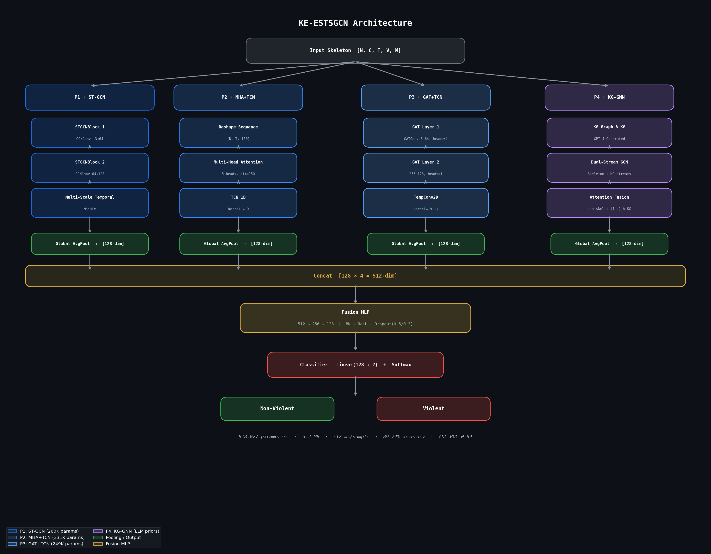

# KE-ESTSGCN: Knowledge-Enhanced Ensemble Spatio-Temporal Skeleton GCN

A lightweight four-pipeline Graph Neural Network for violence detection in surveillance video, augmented with an LLM-generated biomechanical knowledge graph.

> **89.74% accuracy · 90.57% F1 · AUC-ROC 0.94 · 818K parameters · 3.2 MB · ~12 ms/sample**

---

## Architecture

The model processes skeleton sequences `X ∈ R^[N × C × T × V × M]` (C=3 coords, V=25 joints, M=2 persons) through four parallel pipelines, each producing a 128-dim feature vector, then fused via MLP.



### Pipeline Details

| Pipeline | Backbone | Params | Key Design |
|---|---|---|---|
| P1 – ST-GCN | 2× STGCNBlock | 260,418 | GCN + TCN (kernel=9), skeleton adjacency A^skel |
| P2 – Attention | MHA + TCN | 330,730 | 5 heads, flat token sequence length T, TCN projection |
| P3 – GAT | GATConv (4+1 heads) | 249,474 | Skeleton graph, 2D TCN, global avg-pool |
| P4 – KG | Dual-stream KG-GNN | — | LLM knowledge graph A^KG, learned attention fusion |
| Fusion | MLP | — | 512→256→128, BN + Dropout |
| Classifier | Linear | — | Binary output |
| **Total** | | **818,027** | |

### Knowledge Graph Construction (P4)

The KG is built **offline** by prompting GPT-4 to reason over the 25-joint NTU skeleton format and enumerate:
- **Critical joints** (12 most informative for violent actions: shoulders, elbows, wrists, hips, knees)
- **Directed joint relationships** with semantic type (extension, impact trajectory, aggressive posture, alignment) and importance weight w ∈ [0,1]
- **Temporal patterns**: rapid arm extension, impact deceleration, aggressive stance, kicking motion, defensive recoil
- **Spatial features**: extended arms, raised leg, forward lean, wide stance, hand trajectory

This yields a weighted adjacency matrix `A^KG ∈ R^25×25` with 26 non-zero entries. The dual-stream KG module fuses skeleton and KG features via:

```
h_fused = α ⊙ h_skel + (1 − α) ⊙ h_KG
α = sigmoid(W2 · tanh(W1 · [h_skel ∥ h_KG]))
```

---

## Dataset & Training

The RLVS (Real-Life Violence Situations) skeleton dataset used in this work was prepared by:

> N. Janbi, M. Mehmood, R. Mehmood, and I. Katib, "ESTS-GCN: Enhanced
> Spatio-Temporal Skeleton-Based Graph Convolutional Network for Violence
> Detection," *IEEE Access*, vol. 12, pp. 15234–15248, 2024.

Pose estimation and skeletal extraction from raw RGB videos was performed
by the original authors using OpenPose. We gratefully acknowledge their
dataset preparation work. If you use this dataset, please cite the above paper.
```

**Dataset:** Real-Life Violence Situations (RLVS) — 1,951 skeleton sequences (25 joints, NTU format), binary labels (violent / non-violent).

| Split | Samples |
|---|---|
| Train | 1,561 |
| Validation | 195 |
| Test | 195 |

**Training config:** Adam (lr=1e-3, wd=1e-4), cross-entropy loss, ReduceLROnPlateau (factor=0.5, patience=5), 50 epochs, batch size 16, dropout 0.3 (GCN/GAT) / 0.5+0.3 (MLP).

---

## Results

### Final Test Performance

| Metric | Score |
|---|---|
| Accuracy | 89.74% |
| Precision | 91.43% |
| Recall | 89.72% |
| F1-Score | 90.57% |
| AUC-ROC | 0.94 |
| Parameters | 818,027 |
| Model size | 3.2 MB |
| Inference | ~12 ms/sample |

---

## Ablation Study

### Effect of Knowledge Graph Integration

| Metric | w/o KG (3-pipeline) | w/ KG (full model) | Δ |
|---|---|---|---|
| Accuracy | 83.59% | **89.74%** | +6.15% |
| Precision | 89.47% | **91.43%** | +1.96% |
| Recall | 79.44% | **89.72%** | +10.28% |
| F1-Score | 84.13% | **90.57%** | +6.44% |
| AUC-ROC | — | **0.94** | — |

**Key finding:** Recall improves by over 10 percentage points, showing the KG priors substantially reduce missed violent detections. The biomechanical inductive bias helps the model generalise to violence-discriminative patterns underrepresented in training data.

### Per-Pipeline Standalone Performance

| Pipeline | Accuracy | Precision | Recall | F1 | AUC |
|---|---|---|---|---|---|
| P1: ST-GCN only | 79.49% | 79.13% | 85.05% | 81.98% | 0.89 |
| P2: Attention + TCN only | 83.59% | 85.71% | 84.11% | 84.91% | 0.92 |
| P3: GAT + TCN only | 86.15% | 88.46% | 85.98% | 87.20% | 0.93 |
| **Full model (w/ KG)** | **89.74%** | **91.43%** | **89.72%** | **90.57%** | **0.94** |

Each pipeline provides complementary representations; GAT achieves the best single-pipeline result (F1: 87.20%), while the full four-pipeline fusion surpasses all individual components.

---

## Comparison with ESTS-GCN (State of the Art)

| Property | ESTS-GCN | **KE-ESTSGCN (Ours)** |
|---|---|---|
| Pipelines | 3 (SCML, STML, SGML) | 4 (ST-GCN, Attn, GAT, KG) |
| Knowledge graph | None | LLM-generated (GPT-4) |
| Training | Independent per pipeline | Joint end-to-end |
| Spatial blocks/pipeline | 9 | 2 |
| Max output channels | 256 | 128 |
| Total parameters | ~6.7M | **818,027** |
| Parameter reduction | — | **~8× fewer** |
| RLVS Accuracy | 89.12% | **89.74%** |
| AUC-ROC (RLVS) | N/A | **0.94** |
| Model size | — | **3.2 MB** |
| Inference | — | **~12 ms/sample** |

---

## Setup

**Requirements**

```bash
pip install torch torch-geometric
```

**Notebooks** (in order)

| File | Purpose |
|---|---|
| `RLVS_KG_PIPELINE1_ONLY.ipynb` | P1 – ST-GCN pipeline standalone |
| `RLVS_KG_PIPELINE2_ONLY.ipynb` | P2 – MHA+TCN pipeline standalone |
| `RLVS_KG_PIPELINE3_ONLY.ipynb` | P3 – GAT+TCN pipeline standalone |
| `RLVS_KG_PIPELINE3_4.ipynb` | P3 + P4 combined (KG-GNN integration) |
| `RLVS_KnowledgeEnhanced_STGCN.ipynb` | Full four-pipeline KE-ESTSGCN model |

The knowledge graph (`A_KG`) is constructed offline via GPT-4 and fixed before training. Run the full model notebook end-to-end for joint training across all four pipelines.

---

## Limitations

- Evaluated only on RLVS; cross-dataset generalisation (RWF-2000, Hockey Fights) is untested.
- Knowledge graph is static — constructed once via GPT-4 and fixed during training; cannot self-correct or adapt to dataset-specific patterns.
- Binary classification only (violent / non-violent); no fine-grained subtype detection.

---

## Citation

```bibtex
@article{hassan2025keestsgcn,
  title={Lightweight Multi-Pipeline Graph Neural Networks with Knowledge Graph Integration for Violence Recognition},
  author={Hassan, Hasnat Noor and Saif, Shahela and Qamar, Saira},
  journal={},
  year={2025}
}
```
